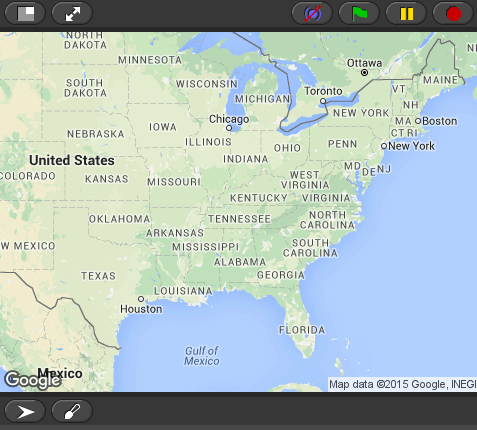

[](https://travis-ci.org/NetsBlox/NetsBlox)
[](http://waffle.io/NetsBlox/NetsBlox)
[](https://gitter.im/NetsBlox/NetsBlox?utm_source=badge&utm_medium=badge&utm_campaign=pr-badge&utm_content=badge)
# NetsBlox
NetsBlox is a visual programming language which allows people to develop networked programs.

## Overview
Netsblox is an extension of _Snap!_ which allows users to use some distributed systems principles and develop networked apps. That is, users can create apps that can interact with other instances of Netsblox.

Currently, we have support for networked _events_ and _messages_ where a message is like an event except contains some additional information. For example, in the Tic-Tac-Toe example, the user is able to  create a "TicTacToe" message which contains the row and column that the user played in.

Along with the events and messages, we also currently support _remote procedure calls_. RPC's are implemented as REST endpoints on the server which can perform some of the more challenging computation for the student (allowing support to make more complicated apps) as well as providing access to extra utilities not otherwise available to the student.

For example, if you import the `map-utilities` RPC blocks which gives the user access to Google Maps with a `map of (latitude), (longitude) with zoom (zoom)` block:


This results in the stage costume changing:



## Quick Start
First clone the repository and install the dependencies.
```
git clone https://github.com/NetsBlox/NetsBlox.git
cd NetsBlox
npm install
```

Next, start the server with `npm start` and navigate to `localhost:8080` in a web browser to try it out!

## Examples
After opening the browser, click the `file` button in the top left and click on `Examples` to check out some example networked apps!

Next, open a new browser window and open the project. Using the arrow keys and spacebar, you should be able to shoot at your opponent!
